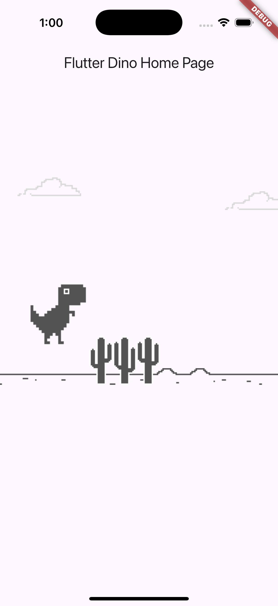
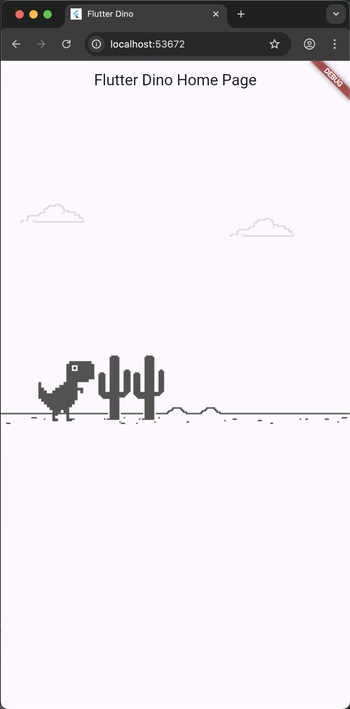
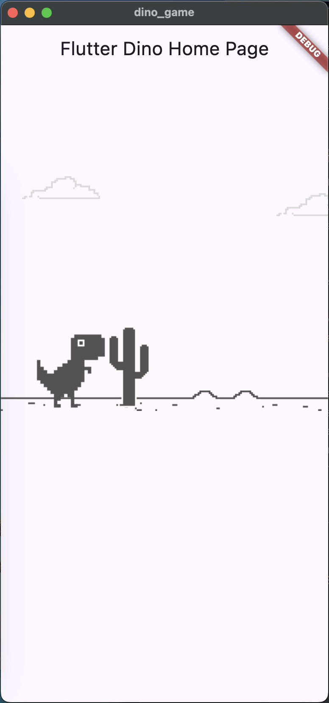

# Flutter Implementation of Chrome's Dino Game

This is a demo repo for how to build Chrome's Dino game in vanilla Flutter.

## Video

This repo corresponds with this YouTube video: https://youtu.be/YlYF1ZdFrp4

## Blog Post

If you prefer a written form you can check out the blog post here: https://www.thkp.co/blog/2020/10/19/building-the-chrome-dino-game-from-scratch-in-flutter


## (June 2025) Update to Flutter 3.29.3 and Dart 3.7.2
Forked to experiment with the game and update Flutter and Dart.

* Sound null-safety
* Regenerated Platform folders using:
```bash
rm -rf android
flutter create .
```

<!-- GitHub-flavored Markdown (GFM) to force image sizes -->
| Android | iOS | Web | MacOS | Linux (Ubuntu) |
|--------|-----|-----|-----|-------|
|  |  |  |  |  |

### Fix iOS compilation issue 

> `Error (Xcode): could not find included file 'Pods/Target Support Files/Pods-Runner/Pods-Runner.debug.xcconfig' in search paths`

1. Execute:
```bash
flutter clean
cd ios
rm -rf Pods Podfile.lock
pod deintegrate
cd ..
flutter pub get
```

2. Manually edit `ios/Podfile`, add `platform :ios, '13.0'` on the top of the file.

3. Execute:
```bash
cd ios
pod install
cd ..
```
> `pod deintegrate` removes CocoaPods from the project, `pod install` adds it again. 

4. iOS should be working, run with:
```bash
flutter run -d ios
```
